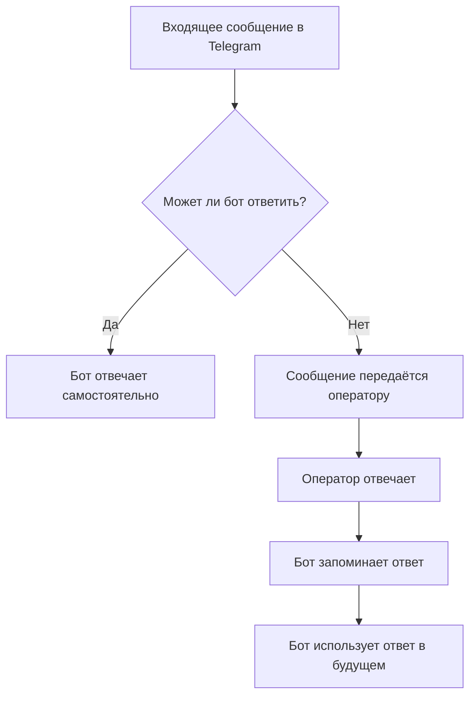

# 🧠 Braindler Assistant

**Braindler Assistant** — это AI-секретарь с обучением на практике, предназначенный для обработки входящих сообщений в Telegram. Он автоматически определяет, может ли ответить самостоятельно, или требуется вмешательство человека, и обучается на предоставленных ответах, чтобы улучшать свои ответы в будущем.

## 🚀 Возможности

* **Автоматическая обработка сообщений**: анализирует входящие сообщения и определяет, может ли ответить самостоятельно.
* **Передача сообщений оператору**: если бот не уверен в ответе, он перенаправляет сообщение человеку.
* **Обучение на ответах**: бот запоминает ответы оператора и использует их для обработки аналогичных запросов в будущем.
* **Интеграция с Telegram**: взаимодействие с пользователями через Telegram-бота.
* **Модульная архитектура**: легко расширяется и настраивается под конкретные задачи.

## 🧠 Архитектура




**Braindler Assistant** — это мультиканальный AI-помощник нового поколения, предназначенный для автоматизации поддержки, продаж и маркетинга через популярные мессенджеры: Telegram, WhatsApp, Line, WeChat, Instagram.

## 🚀 Описание проекта

Braindler Assistant использует блочную структуру AI-чат-скриптов с возможностью импровизации и подключением оператора в реальном времени. Основной упор сделан на качество диалога, имитацию стиля операторов и адаптацию под конкретные бизнес-процессы.

---

## 🔧 Основные возможности

- **Мультиканальность:** Telegram, WhatsApp, Line, WeChat, Instagram.
- **AI-чат-скрипты:** сценарии в виде блоков с гибкой логикой и ветвлениями.
- **Импровизация AI:** при отклонении от скрипта бот генерирует релевантный ответ.
- **Подключение операторов:** полуавтоматический режим с возможностью вмешательства.
- **Обучение на диалогах:** бот сам предлагает улучшения на основе истории общения.
- **Мультиязычность:** автоматическое определение и переключение языков.
- **Стили операторов:** бот подстраивается под стиль каждого оператора.
- **Глубокая интеграция:** подключение CRM, API, систем знаний, рассылок и пр.

---

## 🧩 Применение

- **Поддержка клиентов:** автоматизация FAQ и рутинных задач.
- **Продажи:** квалификация лидов, сопровождение сделок, апселл.
- **Маркетинг:** триггерные рассылки, опросы, генерация лидов.
- **Обратная связь:** сбор отзывов, анализ потребностей клиентов.

---

## 🏗️ Архитектура

Braindler Assistant спроектирован как микросервисная система с разделением ответственности:

- `core-engine`: ядро логики и генерации сообщений
- `script-editor`: визуальный редактор сценариев
- `integration-layer`: канальные шлюзы (Telegram, WhatsApp и др.)
- `operator-console`: интерфейс оператора
- `dialog-memory`: кратко- и долгосрочная память бота
- `analytics`: подсистема анализа диалогов и дообучения модели

---

## 🛠️ Технологии

* **Языковая модель**: использование LLM для обработки естественного языка.
* **Векторное хранилище**: хранение и поиск похожих сообщений и ответов.
* **Telegram API**: взаимодействие с пользователями через Telegram.
* **Python**: основной язык разработки.


## 📦 Установка (в разработке)

> Подробности по запуску, Docker-образам и конфигурации будут добавлены позже.

## 📁 Структура проекта

```text
braindler-assistant/
├── core/                   # ядро бота
├── channels/               # интеграции с мессенджерами
├── scripts/                # блоки сценариев и их редактор
├── operator/               # консоль оператора
├── plugins/                # внешние действия и API
├── storage/                # база диалогов и аналитика
└── README.md
```

---

## 💡 Планы развития

- [x] Сбор и перенос всех идей из [braindler-legacy](https://gitlab.com/braindler-legacy)
- [ ] MVP для Telegram с AI-скриптами и импровизацией
- [ ] Визуальный редактор сценариев
- [ ] Консоль оператора с AI-подсказками
- [ ] Поддержка мультиязычности
- [ ] Интеграции с CRM и API
- [ ] SaaS-версия

---

## 🙏 Благодарности

Проект основан на опыте [Braindler Legacy](https://gitlab.com/braindler-legacy) и вдохновлён стремлением к идеальному пользовательскому опыту в общении между клиентами и бизнесом.


## 📜 Лицензия

extended GPLv3 — см. файл [LICENSE](./LICENSE)
```
