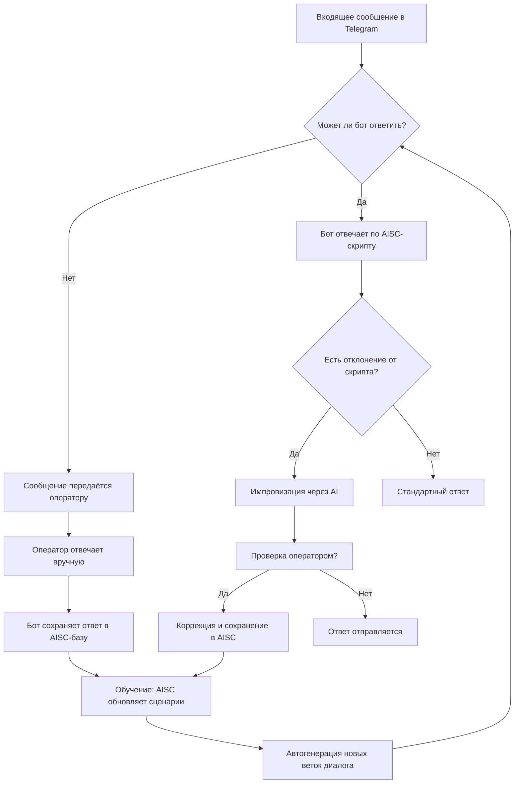

# 🧠 Braindler Secretary

**Braindler Secretary** — мультиязычный AI-секретарь для глобальных коммуникаций. Сочетает предзаписанные сценарии с адаптивным обучением.

---

## 🚀 Описание проекта

Braindler Secretary использует блочную структуру AI-чат-скриптов с возможностью импровизации и подключением оператора в реальном времени. Основной упор сделан на качество диалога и адаптацию под конкретные бизнес-процессы.
human-in-the-loop и feedback-based learning

---

## 🚀 Основные возможности

### 🤖 Интеллектуальная обработка сообщений
- Автоматический анализ входящих запросов (может ли ответить самостоятельно)
- Передача сложных вопросов оператору с контекстом
- Обучение на ручных ответах для аналогичных запросов в будущем

### 🛠️ Функциональные особенности
- **Мультиканальность**: Единая система для Telegram, WhatsApp, Line, WeChat, Instagram, ...
- **Гибкие сценарии**: Блочные AI-чат-скрипты с ветвлениями и импровизацией
- **Динамическое обучение**: Автогенерация новых диалоговых веток на основе истории
- **Автоматический перевод**: Бесшовный перевод вопросов на язык оператора и ответов от оператора на язык пользователя

### 🔌 Интеграции
- Подключение CRM и внешних API
- Триггерные рассылки и сбор аналитики

---

## 🧠 Архитектура



---

## 🧩 Применение

- **Поддержка клиентов:** автоматизация FAQ и рутинных задач.
- **Продажи:** квалификация лидов, сопровождение сделок, апселл.
- **Маркетинг:** триггерные рассылки, опросы, генерация лидов.
- **Обратная связь:** сбор отзывов, анализ потребностей клиентов.

---

## 🏗️ Архитектура

Braindler Secretary спроектирован как микросервисная система с разделением ответственности:

- `core-engine`: ядро логики и генерации сообщений
- `script-editor`: визуальный редактор сценариев
- `integration-layer`: канальные шлюзы (Telegram, WhatsApp и др.)
- `operator-console`: интерфейс оператора
- `dialog-memory`: кратко- и долгосрочная память бота
- `analytics`: подсистема анализа диалогов и дообучения модели

---

## 🛠️ Технологии

* **Языковая модель**: использование LLM для обработки естественного языка.
* **Векторное хранилище**: хранение и поиск похожих сообщений и ответов.
* **Telegram API**: взаимодействие с пользователями через Telegram.
* **Python**: основной язык разработки.


## 📦 Установка (в разработке)

> Подробности по запуску, Docker-образам и конфигурации будут добавлены позже.

## 📁 Структура проекта

```text
braindler-Secretary/
├── core/                   # ядро бота
├── channels/               # интеграции с мессенджерами
├── scripts/                # блоки сценариев и их редактор
├── operator/               # консоль оператора
├── plugins/                # внешние действия и API
├── storage/                # база диалогов и аналитика
└── README.md
```

---

## 💡 Планы развития

- [x] Сбор и перенос всех идей из [braindler-legacy](https://gitlab.com/braindler-legacy)
- [ ] MVP для Telegram с AI-скриптами и импровизацией
- [ ] Визуальный редактор сценариев
- [ ] Консоль оператора с AI-подсказками
- [ ] Поддержка мультиязычности
- [ ] Интеграции с CRM и API
- [ ] SaaS-версия

---

## 🙏 Благодарности

Проект основан на опыте [Braindler Legacy](https://gitlab.com/braindler-legacy) и вдохновлён стремлением к идеальному пользовательскому опыту в общении между клиентами и бизнесом.


## 📜 Лицензия

extended GPLv3 — см. файл [LICENSE](./LICENSE)
```
