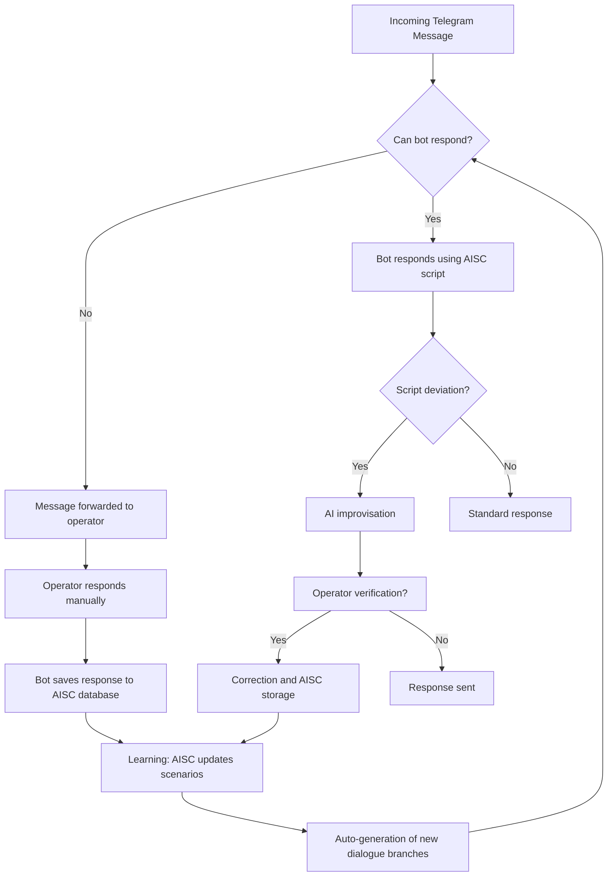

# 🧠 Braindler Secretary

**Braindler Secretary** — an intelligent multilingual AI secretary for business communications with hybrid management (AI + Human-in-the-Loop).

---

## 🚀 Project Description

Braindler Secretary uses a block-based AI chat script structure with improvisation capabilities and real-time operator connection. The main focus is on dialogue quality and adaptation to specific business processes.

---

## 🚀 Key Features

### 🤖 Intelligent Message Processing
- Automatic analysis of incoming requests (can answer independently)
- Transfer of complex questions to operators with context
- Learning from manual responses for similar future requests

### 🛠️ Functional Features
- **Multi-channel**: Unified system for Telegram, WhatsApp, Line, WeChat, Instagram, ...
- **Flexible Scenarios**: Block-based AI chat scripts with branching and improvisation
- **Dynamic Learning**: Auto-generation of new dialogue branches based on history
- **Automatic Translation**: Seamless translation of questions to operator's language and responses back to user's language

### 🔌 Integrations
- CRM and external API connections
- Trigger-based broadcasts and analytics collection



## 🧩 Applications

- **Customer Support:** FAQ automation and routine tasks.
- **Sales:** Lead qualification, deal management, upselling.
- **Marketing:** Trigger-based broadcasts, surveys, lead generation.
- **Feedback:** Review collection, customer needs analysis.

---

## 🏗️ Architecture

Braindler Secretary is designed as a microservice system with separated responsibilities:

- `core-engine`: core logic and message generation
- `script-editor`: visual scenario editor
- `integration-layer`: channel gateways (Telegram, WhatsApp, etc.)
- `operator-console`: operator interface
- `dialog-memory`: bot's short- and long-term memory
- `analytics`: dialogue analysis and model retraining subsystem

---

## 🛠️ Technologies

* **Language Model**: LLM usage for natural language processing
* **Vector Storage**: storage and search for similar messages and responses
* **Telegram API**: user interaction through Telegram
* **Python**: primary development language

## 📦 Installation (in development)

> Details about launch, Docker images, and configuration will be added later.

## 📁 Project Structure

```text
braindler-Secretary/
├── core/                   # bot core
├── channels/               # messenger integrations
├── scripts/                # scenario blocks and editor
├── operator/               # operator console
├── plugins/                # external actions and APIs
├── storage/                # dialogue database and analytics
└── README.md
```

---

## 💡 Development Plans

- [x] Collection and transfer of all ideas from [braindler-legacy](https://gitlab.com/braindler-legacy)
- [ ] Telegram MVP with AI scripts and improvisation
- [ ] Visual scenario editor
- [ ] Operator console with AI suggestions
- [ ] Multilingual support
- [ ] CRM and API integrations
- [ ] SaaS version

---

## 🙏 Acknowledgments

The project is based on the experience of [Braindler Legacy](https://gitlab.com/braindler-legacy) and inspired by the pursuit of perfect user experience in business-client communication.

## 📜 License

extended GPLv3 — see [LICENSE](./LICENSE) file 